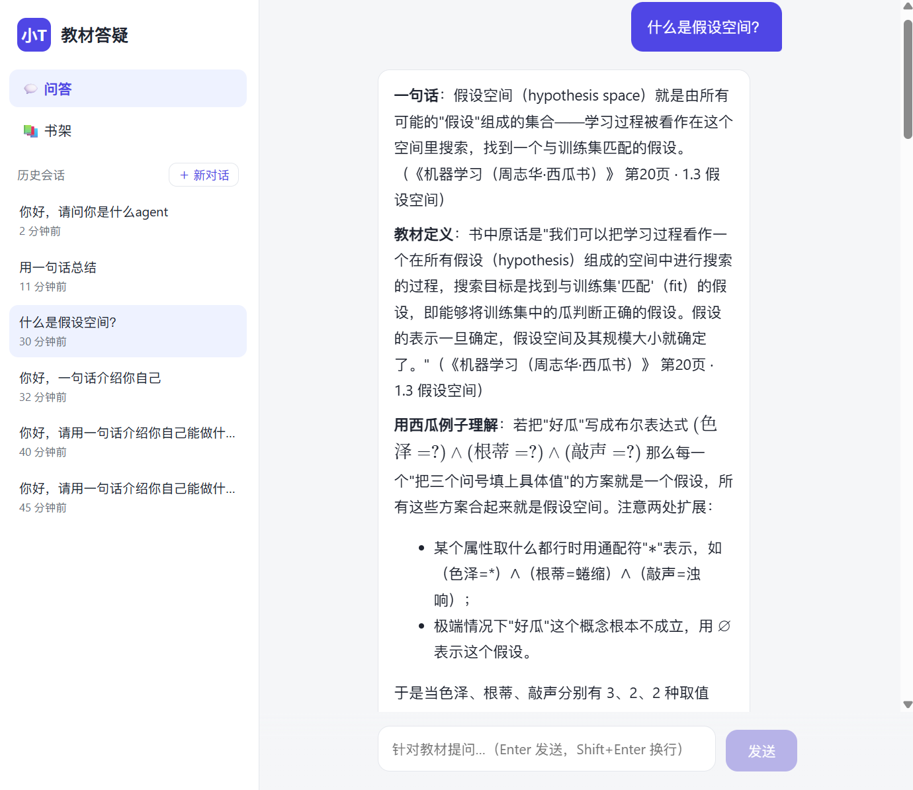
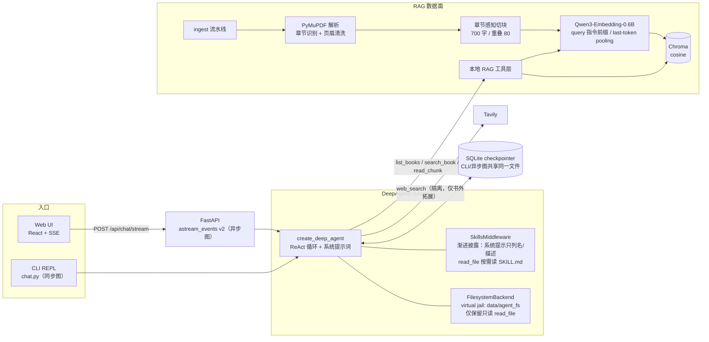
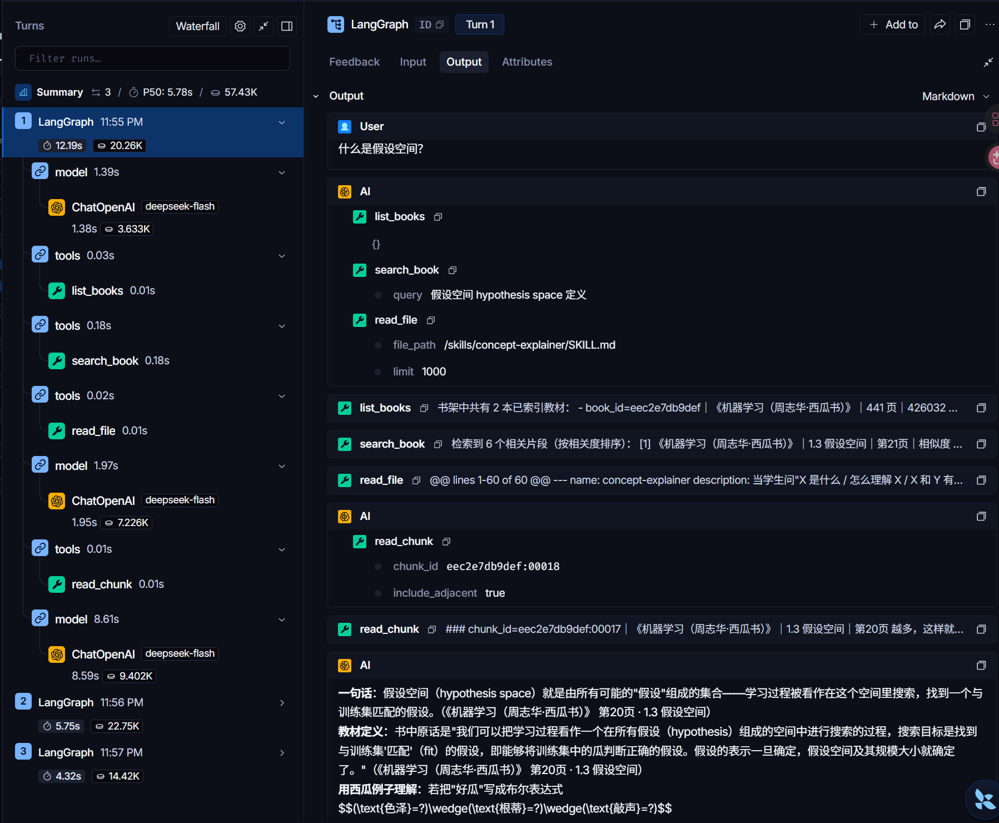

# 小T · teach_agent

**只依据你本地教材原文作答、每条结论标注书名页码的中文教材答疑 Agent。**

基于 [DeepAgents](https://github.com/langchain-ai/deepagents)（LangGraph 之上的 Agent harness）构建：本地 RAG 负责"取证"，LLM 负责"教学"，五条教学法 Skill 负责"怎么教"，CLI 与 Web（FastAPI + React）双入口共享同一套 Agent 装配与会话记忆。



---

## 它能做什么

- **教材语义问答**：问概念、问公式推导、问题目、让它带你复习一章；答案只来自已入库教材原文，关键结论逐处标注《书名》章节与页码，末尾附完整引用清单。
- **低分不硬答**：向量相似度低于阈值即进入拒答流程，明说"这套教材里没有直接讲到"，不用模型参数记忆编造书本外结论。
- **教学法而非聊天**：内置 5 条可执行的教学 Skill（学习教练 / 概念讲解 / 公式推导 / 习题辅导 / 章节复习），覆盖最近发展区定级、提取练习 + 间隔 + 交错练习、苏格拉底式错题引导，而不是直接甩答案。
- **多轮记忆**：基于 LangGraph checkpointer（SQLite），同一 `thread_id` 跨进程续聊，"那它的公式呢？"这类指代会被正确解析。
- **两种用法**：终端 REPL（CLI）与浏览器 Web（SSE 逐 token 流式、工具调用过程可展开、来源页码卡片、书架上传三态、历史会话回放）。
- **全本地取证**：embedding 使用本地 Qwen3-Embedding-0.6B，教材文本不出本机；网络检索（Tavily）与教材主链路隔离，仅在用户明确要求书外拓展时启用。

## 快速开始

### 1. 环境要求

- Python ≥ 3.12、[uv](https://docs.astral.sh/uv/)
- Node.js ≥ 20（仅构建/开发 Web 前端时需要）
- 首次运行会从 HuggingFace 缓存加载本地 embedding 模型（Qwen3-Embedding-0.6B）；有 GPU 自动使用 CUDA，无 GPU 走 CPU

### 2. 安装与配置

```bash
git clone https://github.com/xiaoberber8-ai/teach_agent.git
cd teach_agent
uv sync                       # 安装 Python 依赖
cp .env.example .env          # 然后填入你自己的 TEACH_LLM_API_KEY
```

`.env` 中只需配置答疑 LLM（任何 OpenAI 兼容端点均可，默认 DeepSeek）：

```dotenv
TEACH_LLM_BASE_URL=https://api.deepseek.com/v1
TEACH_LLM_API_KEY=sk-xxxx          # 填你自己的 key，.env 已被 .gitignore 忽略
TEACH_LLM_MODEL=deepseek-flash
```

> M1 入库与检索链路完全离线，不需要任何 API key；只有 M2 起的 Agent 问答需要 LLM key。Tavily、LangSmith 均为可选项。

### 3. 入库一本教材

```bash
uv run python -m teach_agent.ingest /path/to/机器学习.pdf --title "机器学习（周志华）"
uv run python -m teach_agent.list          # 查看书架与入库状态
```

文字版 PDF / TXT 均可；扫描版 PDF（无文字层）会被准确识别并拒绝入库并给出提示（OCR 在路线图 M6）。

### 4. 开始提问

**命令行：**

```bash
uv run python -m teach_agent.chat          # 交互式 REPL
uv run python -m teach_agent.chat --list   # 列出历史会话
```

**Web（开发模式）：**

```bash
uv run uvicorn teach_agent.server:app --host 127.0.0.1 --port 8000   # 终端 A
cd frontend && npm install && npm run dev                            # 终端 B（:5173，/api 代理到 8000）
```

**Web（单端口生产模式）：**

```bash
cd frontend && npm install && npm run build      # 产物落 frontend/dist
cd .. && uv run uvicorn teach_agent.server:app --host 127.0.0.1 --port 8000
# 浏览器直接打开 http://127.0.0.1:8000，FastAPI 托管构建产物并对前端路由做 SPA 回退
```

更详细的功能说明、接口与排障见 **[docs/USAGE.md](docs/USAGE.md)**。

## 系统架构



### DeepAgents 装配要点（`src/teach_agent/agent.py`）

- `create_deep_agent()` 统一装配同步 / 异步两张图：同一模型、同一工具集、同一系统提示词、同一 jail 与 Skill 目录，差异仅在 checkpointer。
- 通过 `register_harness_profile()` 为本模型注册 harness 策略：**关闭 general-purpose 子代理**（`task` 工具），并剔除 7 个写/执行类内置文件工具（`write_file/edit_file/delete/ls/glob/grep/execute`），只保留只读 `read_file`——因为 SkillsMiddleware 的渐进披露要求模型自行读取 `SKILL.md`，而模型不应拥有任何写文件或执行命令的能力。
- `FilesystemBackend(root_dir=data/agent_fs, virtual_mode=True)` 构成文件系统沙箱（jail）：模型所见路径全部为虚拟路径，`../` 逃逸会被直接抛错阻断；产品 Skill 源文件在仓库 `skills/`，Agent 启动时增量同步进 jail。
- 持久化：CLI 用同步 `SqliteSaver`，Web 用 `AsyncSqliteSaver`（`astream_events` 必须异步 checkpointer），两者经 WAL 模式共享同一个 `data/checkpoints.sqlite`。

### RAG 流水线（M1）

| 环节 | 实现 | 关键处理 |
|---|---|---|
| 解析 | PyMuPDF | NBSP 规范化、页眉/页脚碎片剔除；平均每页字符数 < 50 判定为扫描版并拒绝 |
| 切块 | 章节感知切分（`splitting.py`） | 以目录点引为高信任源收割章节名，700 字/块、80 字重叠，块元数据带书名、章节、起止页码 |
| 向量化 | Qwen3-Embedding-0.6B（本地） | query 侧拼 `Instruct: {task}\nQuery:` 指令、last-token pooling、L2 归一；文档侧不加指令 |
| 检索 | Chroma cosine | TOP_K=6，distance 阈值 0.42（≈ 相似度 0.58，保守初值） |

### 工具集：只"取证"，不"作答"

`list_books` / `search_book` / `read_chunk` / `web_search`（见 `tools.py`）全部只返回原文证据与结构化的"未检索到"原因；所有结论由 LLM 基于证据组织。`search_book` 的 docstring 明确引导模型换同义词/英文术语重试 1-3 次后再拒答，`read_chunk` 支持 `include_adjacent` 取回跨页证明的完整上下文。

### 教学 Skill（`skills/*/SKILL.md`）

| Skill | 触发场景 | 核心方法 |
|---|---|---|
| learning-coach | 目标/节奏类、首次对话 | 一次只问一个澄清问题；最近发展区三级定级；流畅度 ≠ 存储强度；提取练习 + 间隔（今天/明天/三天后）+ 交错；**其他四技能的调度入口** |
| concept-explainer | "X 是什么" | 一句话直答 → 类比（含失效点）→ 教材定义 → 正反例 → 易混对比表 → 闭卷自测 |
| formula-derivation | 公式推导 | 符号清单 → 逐步标注依据 → 量纲/特例检验 → 闭卷变式口算；含 OCR 错符还原约定 |
| exercise-tutor | 做题/对答案 | 错因四级分类、提示四级阶梯，禁止直接给答案，作答后即时反馈 |
| chapter-review | 章末复习 | 知识地图 → 结论卡 → 三类考点 → 5–9 道交错盲测题；禁止补充检索不到的小节 |

系统提示词（`prompts.py`）中只写入技能路由规则与名称，`SKILL.md` 全文由模型在需要时自行 `read_file` 拉取——这是 DeepAgents SkillsMiddleware 的**渐进披露（progressive disclosure）**模式：控制每轮上下文体积，同时让技能内容可以独立迭代、随仓库分发。

## 目录结构

```
teach_agent/
├── src/teach_agent/
│   ├── agent.py          # DeepAgents 装配：harness profile / jail / skills / 双 checkpointer
│   ├── prompts.py        # 系统提示词：工作流、引用与拒答规则、技能路由
│   ├── tools.py          # 4 个 RAG/网络工具（只取证）
│   ├── parsers.py        # PDF/TXT 解析与扫描版检测
│   ├── splitting.py      # 章节感知切块
│   ├── embeddings.py     # Qwen3 embedding 单例（双重检查锁）
│   ├── vectorstore.py    # Chroma collection
│   ├── retriever.py      # 阈值检索
│   ├── store.py/schema.py# 书架元数据 SQLite（books 表三态）
│   ├── indexing.py       # 入库流水线
│   ├── ingest.py/list.py/search.py  # M1 CLI
│   ├── chat.py           # M2 多轮 REPL
│   ├── sessions.py       # 跨进程列出 checkpoint 会话
│   └── server.py         # M3 FastAPI：书架/上传/SSE 问答/会话回放
├── skills/               # 5 条教学技能（随仓库分发，启动时同步入 jail）
├── frontend/             # Vite + React + TypeScript（SSE 流式 / KaTeX / 来源卡片）
├── scripts/              # 样例 PDF 生成脚本
├── docs/                 # 使用说明与截图
├── .env.example
└── pyproject.toml
```

运行时产物全部落在 `data/`（原书、切块、Chroma、两个 SQLite、jail），已在 `.gitignore` 中忽略，整目录删除即可完全重置。

## 可观测性

设置 `LANGSMITH_TRACING=true` 与 `LANGSMITH_API_KEY` 后，ReAct 每一步的 model/tools 耗时、token、工具入参出参都会上报到 LangSmith，可直接观察"检索 → 读技能 → 复读原文 → 作答"的完整链路：



## 路线图

- [x] **M1** 离线 RAG：入库流水线 + 章节切块 + 本地 embedding + 阈值检索
- [x] **M2** DeepAgents CLI：ReAct 工具调用、jail、教学 Skill、SQLite 持久会话
- [x] **M3** Web：FastAPI SSE 流式问答、书架上传三态、React 前端、历史会话回放
- [ ] **M4** SqliteStore 长时学习画像：跨会话的水平定级、错题档案与间隔复习调度（让 learning-coach 持久化）
- [ ] **M5** BM25 + 向量混合检索（改善符号/定理名等关键词场景）
- [ ] **M6** OCR 入库（marker / 视觉模型，支持扫描版教材）

## 安全说明

- 仓库不包含任何 API key：`.env` 已被 git 忽略，提交前请确认不要使用 `git add -f` 强制加入。
- Agent 的文件访问被 jail 限制在 `data/agent_fs/` 内且只读；写/执行类工具在 harness 层被剔除。
- 教材原文与向量库均保留在本机，答疑检索不经过外部服务；只有 LLM 推理与（显式触发的）网络检索会发出网络请求。
