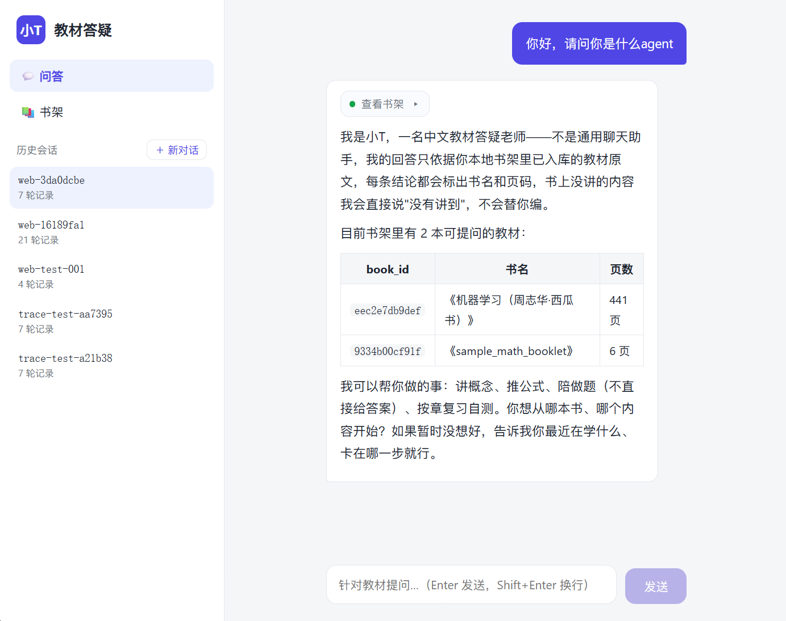
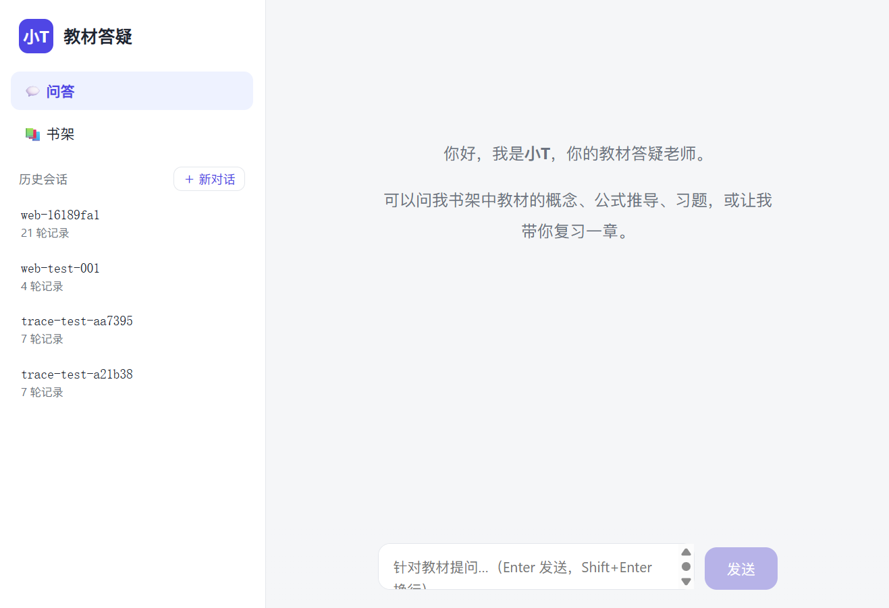
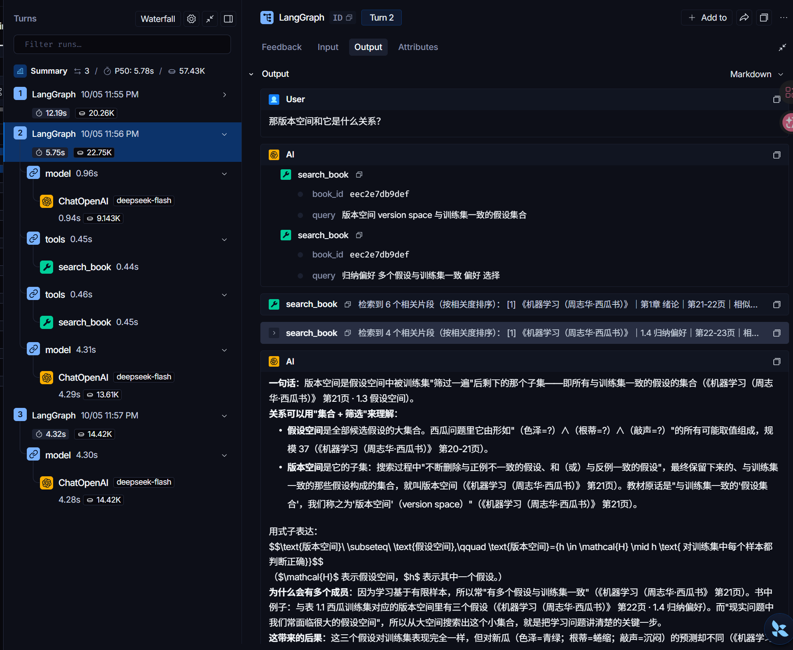
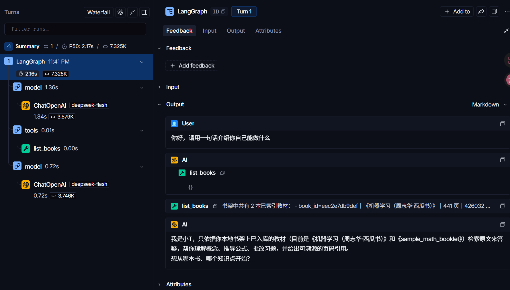

# 小T · 使用说明

面向使用者的完整手册：从安装、教材入库，到 CLI / Web 两种用法、HTTP 接口、配置项与常见问题。架构原理与 DeepAgents 装配细节见根目录 [README.md](../README.md)。

---

## 目录

1. [安装与环境变量](#1-安装与环境变量)
2. [教材入库](#2-教材入库)
3. [命令行问答（CLI）](#3-命令行问答cli)
4. [Web 界面使用](#4-web-界面使用)
5. [HTTP 接口（给二次开发）](#5-http-接口给二次开发)
6. [提问方式建议](#6-提问方式建议)
7. [配置项一览](#7-配置项一览)
8. [常见问题](#8-常见问题)

---

## 1. 安装与环境变量

```bash
git clone https://github.com/xiaoberber8-ai/teach_agent.git
cd teach_agent
uv sync                       # Python ≥ 3.12，依赖见 pyproject.toml
cp .env.example .env          # 编辑 .env，至少填入 TEACH_LLM_API_KEY
```

`.env` 关键项：

| 变量 | 必需性 | 说明 |
|---|---|---|
| `TEACH_LLM_API_KEY` | **问答必需** | 答疑 LLM 的 key；入库/纯检索不需要 |
| `TEACH_LLM_BASE_URL` / `TEACH_LLM_MODEL` | 有默认值 | 任何 OpenAI 兼容端点均可，默认 DeepSeek 官方端点 + `deepseek-flash` |
| `TAVILY_API_KEY` | 可选 | 不配则网络检索工具自动返回"不可用"，不影响教材答疑 |
| `LANGSMITH_TRACING` / `LANGSMITH_API_KEY` | 可选 | Agent 全链路追踪，排障与观察工具调用时强烈建议开启 |
| `TEACH_EMBED_*`、`TEACH_CHUNK_*`、`TEACH_TOP_K` 等 | 有默认值 | 见[第 7 节](#7-配置项一览) |

> 首次运行 embedding 会加载本地 Qwen3-Embedding-0.6B（HuggingFace 缓存），模型权重不出本机。

## 2. 教材入库

```bash
# 基本用法（书名从文件名自动清洗）
uv run python -m teach_agent.ingest /path/to/book.pdf

# 显式书名（PDF 元数据标题不会覆盖它）
uv run python -m teach_agent.ingest /path/to/mlbook.pdf --title "机器学习（周志华·西瓜书）"

# 同一本书重新解析、重建索引（先删旧向量再写）
uv run python -m teach_agent.ingest /path/to/book.pdf --reindex
```

入库流水线：**解析（PyMuPDF）→ 章节识别与页眉清洗 → 章节感知切块（700 字 / 重叠 80）→ 本地 embedding → 写入 Chroma 与书架元数据库**。每个文本块都带书名、章节、起止页码，这是回答中页码引用可溯的来源。

查看书架：

```bash
uv run python -m teach_agent.list
```

也可以不经过 Agent，直接在命令行测检索效果：

```bash
uv run python -m teach_agent.search "什么是假设空间"
uv run python -m teach_agent.search "information gain 信息增益" --book-id <book_id> -k 4
```

**扫描版 PDF**（无文字层，平均每页提取字符数低于阈值）会被直接拒绝并返回退出码 2，例如：

> ✗ 扫描版 PDF：该 PDF 疑似扫描版（487 页，平均每页仅提取到 0.0 个字符，阈值 50）。当前无文字层可供索引，请改用文字版 PDF，或等 OCR 能力上线。

## 3. 命令行问答（CLI）

```bash
uv run python -m teach_agent.chat              # 启动交互 REPL，首次可选择续聊旧会话
uv run python -m teach_agent.chat --list       # 列出历史会话后退出
uv run python -m teach_agent.chat --thread web-16189fa1   # 直接恢复指定会话
```

REPL 内命令：

| 命令 | 作用 |
|---|---|
| `/new` | 开新会话（新 `thread_id`） |
| `/sessions` | 列出已有会话 |
| `/resume <thread_id>` | 切换并续聊历史会话 |
| `/exit` | 退出（历史已自动落盘） |

会话历史保存在 `data/checkpoints.sqlite`（LangGraph checkpointer），**重开进程用同一 `thread_id` 即可完整续聊**，多轮指代（"它的公式呢"）由对话历史解析。

## 4. Web 界面使用

### 4.1 启动方式

开发模式（前后端热更新）：

```bash
# 终端 A：后端
uv run uvicorn teach_agent.server:app --host 127.0.0.1 --port 8000
# 终端 B：前端
cd frontend && npm install && npm run dev      # http://localhost:5173
```

生产模式（FastAPI 单端口托管构建产物，带 SPA 路由回退）：

```bash
cd frontend && npm install && npm run build
cd .. && uv run uvicorn teach_agent.server:app --host 127.0.0.1 --port 8000
# 打开 http://127.0.0.1:8000
```

### 4.2 问答页

打开后左侧是导航与历史会话，主区为对话流。历史会话按最近活跃排序，显示**首条提问标题**与相对时间；点击任一条会从 checkpoint 回放该会话的完整问答：


回答特性：

- **逐 token 流式输出**，Markdown 与 LaTeX（KaTeX）实时排版；
- 回答上方的**工具调用条**记录 Agent 的取证过程，点击可展开。`检索教材原文` 会渲染为来源卡片：书名、章节、页码、相似度、chunk_id；其他工具显示原始输出；
- 每个关键结论后有行内引用（《书名》 第 x 页 · 章节），回答末尾附完整"引用："清单。

首次提问时，Agent 通常先调用 `list_books` 查看书架，再开始检索。工具条展开后可以看到它读到的书目信息：



### 4.3 书架页与上传

- 书架页展示每本书的状态徽标：**已索引**（绿）、**处理中**（琥珀色脉冲，前端每 2 秒轮询）、**失败**（红，附原因）；
- 在右上角上传卡片选择 PDF/TXT（≤ 100 MB），可填书名、可勾选强制重建索引；
- 上传在后端**单线程后台执行**入库流水线（避免并发加载 embedding 模型造成资源竞争），重复上传同一已索引文件会返回 `duplicated=true`。

### 4.4 空状态与历史加载

新对话或无历史的会话显示欢迎引导；正在从后端回放历史时显示"正在加载历史记录…"；若因网络问题加载失败，会显示"点击重试"而不是伪装成空会话。



## 5. HTTP 接口（给二次开发）

服务启动于 `http://127.0.0.1:8000`，前端开发服务器把 `/api` 代理到该地址。

| 方法与路径 | 说明 |
|---|---|
| `GET /api/books` | 书架列表（含 status / 页数 / 字符数 / error） |
| `POST /api/books/upload` | `multipart/form-data`：`file`、`title`（可选）、`reindex`（可选）。立即返回 `{book_id, status, duplicated}`，后台异步入库 |
| `GET /api/sessions` | 会话列表，含首条提问标题、轮次、最近活跃时间 |
| `GET /api/sessions/{thread_id}/messages` | 回放会话可见消息（human / 带正文的 AI 消息；工具消息与空中转消息已过滤） |
| `POST /api/chat/stream` | SSE 流式问答，请求体 `{"thread_id": "...", "message": "..."}` |

SSE 事件类型（`data: {json}\n\n`）：

| event type | 字段 | 含义 |
|---|---|---|
| `token` | `text` | 回答增量 token，前端拼接显示 |
| `tool_start` | `id`, `name` | 工具开始（list_books / search_book / read_chunk / read_file / web_search） |
| `tool_end` | `id`, `name`, `output` | 工具结束，`output` 为截断后的文本（前端对 search_book 正则解析来源卡片） |
| `done` | — | 本轮正常结束 |
| `error` | `message` | 链路异常信息 |

命令行测通整条链路：

```bash
curl -N -X POST http://127.0.0.1:8000/api/chat/stream \
  -H 'Content-Type: application/json' \
  -d '{"thread_id":"web-demo","message":"什么是过拟合？一句话说清"}'
```

## 6. 提问方式建议

小T 的每轮回答都会在 LangGraph 中形成一条可观测的 ReAct 链路。下图是一次典型的概念答疑：模型先 `list_books` 确认书架，再以"假设空间 hypothesis space 定义"为 query `search_book` 取证，然后 `read_file` 读取 `concept-explainer` 技能全文决定教学结构，必要时 `read_chunk` 取回被截断的原文，最后组织带引用的回答：


追问会带着完整对话历史进入同一 `thread_id`，指代会被解析为上文概念，并触发新的针对性检索（下图中"它"被解析为假设空间，模型连续检索"版本空间"与"归纳偏好"两个角度后作答）：



对话开始时它会先查看书架并据此自陈能力边界，这也是第一轮通常只看到一次 `list_books` 调用的原因：



实践建议：

- **直接用书上的术语提问**，附上英文/符号别名检索更稳，例如"信息增益（information gain）怎么算"；
- 概念题适合问"X 是什么 / X 和 Y 的区别"；推导题可以说"推一下 XX 公式，每步说依据"；做题时把题目发来并说明"先别给答案，给我提示"；
- 想复习时说"带我复习第 3 章，出几道盲测题"，会走章节复习技能；
- 书里确实没有的内容它会明说拒答；如确需书外拓展，请明确说"上网查一下最新进展"，网络结果会与教材内容分段并附 URL。

## 7. 配置项一览

全部配置均可通过环境变量 / `.env` 覆盖（默认值见 `src/teach_agent/config.py`）：

| 变量 | 默认值 | 说明 |
|---|---|---|
| `TEACH_DATA_DIR` | 项目内 `data/` | 原书、Chroma、SQLite、jail 的根目录，整目录可备份/重置 |
| `TEACH_EMBED_MODEL` | `Qwen/Qwen3-Embedding-0.6B` | 本地 embedding 模型 |
| `TEACH_EMBED_DEVICE` | `auto` | `auto` / `cuda` / `cpu` |
| `TEACH_EMBED_BATCH_SIZE` | `8` | 入库向量化批大小，显存不足时调小 |
| `TEACH_EMBED_MAX_LENGTH` | `8192` | embedding 最大 token 长度 |
| `TEACH_CHUNK_SIZE` / `TEACH_CHUNK_OVERLAP` | `700` / `80` | 切块大小与重叠；**修改后需对旧书 `--reindex` 才生效** |
| `TEACH_TOP_K` | `6` | 每次检索返回片段数 |
| `TEACH_SCORE_THRESHOLD` | `0.42` | Chroma cosine distance 阈值（distance = 1 − 余弦相似度），值越小越严格；漏答增多时可调大，乱答增多时调小，调整后建议用黄金问答集回归 |
| `TEACH_MAX_FILE_MB` | `100` | Web 上传大小上限 |
| `TEACH_SCAN_AVG_CHARS_PER_PAGE` | `50` | 扫描版判定阈值 |
| `TEACH_LLM_TEMPERATURE` | `0.3` | 答疑模型温度 |

## 8. 常见问题

**Q：启动问答时报 `缺少 TEACH_LLM_API_KEY`？**
A：M1 入库不需要 key；M2/M3 的 Agent 问答必须在 `.env` 配置。复制 `.env.example` 为 `.env` 后填入自己的 key。

**Q：入库时提示扫描版？**
A：当前只处理带文字层的 PDF/TXT。可先用其他工具 OCR 成文字版 PDF 再入库；原生 OCR 在路线图中。

**Q：回答说"书里没讲到"，但其实讲了？**
A：先换关键词/英文术语/符号再问一次；仍频繁漏答可适当调大 `TEACH_SCORE_THRESHOLD`（如 0.45）并 `--reindex` 不需要（阈值仅影响检索，无需重建）。注意阈值放太宽会引入不相关片段。

**Q：CLI 和 Web 能同时跑吗？**
A：可以先后启动，两者共享同一个 `data/checkpoints.sqlite`（WAL 模式），同一 thread_id 的历史互相可见。不建议同一秒内对同一会话并发写入。

**Q：如何重置全部数据？**
A：停止服务后删除 `data/` 目录即可，下次入库/启动会自动重建。

**Q：想换一个 OpenAI 兼容模型？**
A：只改 `.env` 的 `TEACH_LLM_BASE_URL` / `TEACH_LLM_MODEL` / `TEACH_LLM_API_KEY` 三项，代码无需改动。harness profile 按 `openai:{模型名}` 注册，换模型后会自动套用同一套"关子代理 + 剔写执行工具"的安全策略。

**Q：教学技能可以自己改吗？**
A：可以。直接编辑仓库 `skills/<name>/SKILL.md`（保留 YAML frontmatter 的 `name` 与 `description`），下次启动 Agent 时会增量同步进 jail。想新增技能：新建 `skills/your-skill/SKILL.md`，并在系统提示词的技能路由处补一行触发规则。
